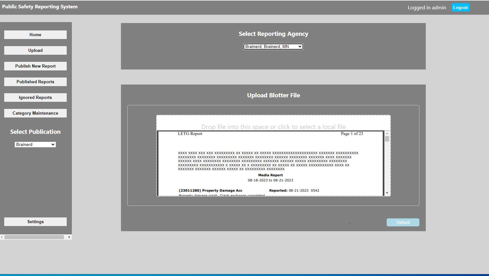

<!-- Improved compatibility of back to top link: See: https://github.com/othneildrew/Best-README-Template/pull/73 -->

<!--
*** Thanks for checking out the Best-README-Template. If you have a suggestion
*** that would make this better, please fork the repo and create a pull request
*** or simply open an issue with the tag "enhancement".
*** Don't forget to give the project a star!
*** Thanks again! Now go create something AMAZING! :D
-->

<!-- PROJECT SHIELDS -->
<!--
*** I'm using markdown "reference style" links for readability.
*** Reference links are enclosed in brackets [ ] instead of parentheses ( ).
*** See the bottom of this document for the declaration of the reference variables
*** for contributors-url, forks-url, etc. This is an optional, concise syntax you may use.
*** https://www.markdownguide.org/basic-syntax/#reference-style-links

[![Contributors][contributors-shield]][contributors-url]
[![Forks][forks-shield]][forks-url]
[![Stargazers][stars-shield]][stars-url]
[![Issues][issues-shield]][issues-url]
[![MIT License][license-shield]][license-url]
[![LinkedIn][linkedin-shield]][linkedin-url]
-->

<!-- PROJECT LOGO -->
 

  

<h3 align="center">Public Safety Reporting System</h3>

<!--  

    project_description
     
    <a href="https://github.com/github_username/repo_name"><strong>Explore the docs »</strong></a>
     
     
    <a href="https://github.com/github_username/repo_name">View Demo</a>
    ·
    <a href="https://github.com/github_username/repo_name/issues">Report Bug</a>
    ·
    <a href="https://github.com/github_username/repo_name/issues">Request Feature</a>
  
 -->

<!-- TABLE OF CONTENTS -->

  
Table of Contents

  <ol>
    <li>
      <a href="#about-the-project">About The Project</a>
      <ul>
        <li><a href="#project-objectives">Project Objectives</a></li>
        <li><a href="#how-it-operates">How It Operates</a></li>
        <li><a href="#built-with">Built With</a></li>
      </ul>
    </li>
    <li>
      <a href="#getting-started">Getting Started</a>
      <ul>
        <!-- <li><a href="#production">Production</a></li> -->
        <li><a href="#prerequisites">Prerequisites</a></li>
        <!-- <li><a href="#installation">Installation</a></li> -->
      </ul>
    </li>
    <li><a href="#usage">Usage</a></li>
    <li><a href="#roadmap">Roadmap</a></li>
    <li><a href="#contributing">Contributing</a></li>
    <li><a href="#license">License</a></li>
    <li><a href="#contact">Contact</a></li>
  </ol>

<!-- ABOUT THE PROJECT -->
## About The Project

The Public Safety Reporting System (PSRS) is a prototype web application that parses police blotters from unstructured PDF sources, applies editorial logic to the data to help journalists identify and select relevant incidents, and transmits collections of incidents as reports for publication to a commercial automated writing service, which then delivers them as a draft story into the CMS.

This project was originally built for Brainerd Dispatch in Brainerd, Minnesota. The Associated Press and University of Missouri collaborated to develop this application as part of the Local News AI Initiative, funded by the [John S. and James L. Knight Foundation](https://knightfoundation.org/articles/ai-for-local-news-advancing-business-sustainability-in-newsrooms/), which aims to leverage AI for the benefit of local news.

The development team thanks the staff at [Brainerd Dispatch](https://www.brainerddispatch.com/) and [Forum Communications](https://www.forumcomm.com/) for proposing this project, and for their participation, feedback, and encouragement. The development team also recognizes the efforts of commercial automated writing vendor [Lede AI](https://ledeai.com/) which built new capabilities to support this police blotter reporting project.

### Project Objectives

- **Free Up Time:** Automating the production of police blotters to reduce the time burden on journalists so they can report on more complex public safety stories.
- **Allow for Journalist Review:** The automation doesn't replace journalists, but it supports them in producing police blotters faster, so they can edit a final version sooner.
- **Cost Effectiveness:** Running the system should not incur expenses greater than the savings or revenue gains generated by using it.

### How It Operates

PSRS functions through this process:

1. **Upload:** The system takes an input of police blotter PDFs generated by public safety agencies. It is uploaded via the web application (see image above).
2. **Parsing:** A parser extracts individual incidents from the uploaded PDF and inserts them into the MySQL database.
3. **Incident Selection:** The incidents are presented in order of editorial priority, the system awaits a journalist to select incidents for publication (see image below).
4. **Story Generation:** The selected incidents are assembled into a report per public safety agency. This process is provided by the commercial automated writing vendor.
5. **Publication:** The draft story is uploaded to the CMS via API as a draft story for review by a journalist. This process is provided by the commercial automated writing vendor.

> Note: In the second step, the parsers are customized to the format of the police blotters generated by three Minnesota public safety agencies. PSRS is built for flexibility in allowing developers to insert any number of new parsers which can be tied to one or many public safety agencies.

> Note: While the fourth and fifth steps are tied to a commercial automated writing vendor, PSRS is built to allow developers flexibility to connect to any automated writing service via API. 

(<a href="#readme-top">back to top</a>)

### Built With

* [![Python][Python]][Python-url]

* [![React][React.js]][React-url]

(<a href="#readme-top">back to top</a>)

<!-- GETTING STARTED -->
## Getting Started

PSRS was originally designed to be hosted on Amazon Web Services. See [administrators](docs/administrators.md) for installation details.

The backend tech stack is Python with Flask RestAPIs and MySQL database with ORM tool as SQLAlchemy. See [backend](docs/backend.md) for details.

The front end is built with React. See [front end](docs/frontend.md) for details.

### Prerequisites

* MySQL
* Postman (to access some maintenance features)
* Lede AI (for automated writing)
* Amazon Web Services (for production hosting)

(<a href="#readme-top">back to top</a>)

<!-- USAGE EXAMPLES -->
## Usage

For day-to-day usage, editorial staff should access PSRS via the UI at `http://IP_ADDRESS/loginpage`

For system maintenance, such as adding or deleting public safety agencies, adding or deleting users, there are a series of Postman scripts available in the `postman-scripts` folder. 

> Note: The Postman scripts need to be modified to adjust for urls, usernames, and passwords. 

(<a href="#readme-top">back to top</a>)

<!-- ROADMAP -->
## Roadmap

At the end of the MVP development period, these were the features that we thought would be useful to have in the future:

- [ ] Self-service matching feature that allows the user to match detected blotter document fields to database columns. This feature was partially developed, see the notes in [backend](docs/backend.md) and [front end](docs/frontend.md).
- [ ] The database currently collects all incident reports without any clean-up operations. The collected data can be useful for future data journalism tasks. Data management features will need to be considered, such as an export to CSV function, or perhaps an API link to a data visualization tool.
- [ ] Management features in the UI to eliminate the need for Postman scripts.
- [ ] Outbound connections with other automated writing systems.
- [ ] New parsers to handle a variety of popular blotter formats. (The ideal outcome would be an AI-powered parser that can handle all sorts of police blotter formats.)
- [ ] Improvements in password handling to add random bytes of salt.

(<a href="#readme-top">back to top</a>)

<!-- CONTRIBUTING -->
## Contributing

Contributions are what make the open-source community such an amazing place to learn, inspire, and create. Any contributions you make are **greatly appreciated**.

If you have a suggestion that would make this better, please fork the repo and create a pull request. You can also simply open an issue with the tag "enhancement".
Don't forget to give the project a star! Thanks again!

1. Fork the Project
2. Create your Feature Branch (`git checkout -b feature/AmazingFeature`)
3. Commit your Changes (`git commit -m 'Add some AmazingFeature'`)
4. Push to the Branch (`git push origin feature/AmazingFeature`)
5. Open a Pull Request

(<a href="#readme-top">back to top</a>)

<!-- LICENSE -->
## License

Distributed under the GNU GENERAL PUBLIC LICENSE. See `LICENSE` for more information.

(<a href="#readme-top">back to top</a>)

<!-- CONTACT -->
## Contact

*The Associated Press does not provide technical support for this open-source application.*

Prasad Calyam - calyamp@missouri.edu

Project Link: [https://github.com/associatedpress/local-ai-brainerd-dispatch](https://github.com/associatedpress/local-ai-brainerd-dispatch)

<!-- ORIGINAL DEVELOPERS -->
### Original Developers

* Hemanth Sai - [@hemanth5555](https://github.com/hemanth5555) - University of Missouri
* Kiran Neupane - [@kngbq](https://github.com/kngbq) - University of Missouri

(<a href="#readme-top">back to top</a>)

<!-- MARKDOWN LINKS & IMAGES -->
<!-- https://www.markdownguide.org/basic-syntax/#reference-style-links -->
[contributors-shield]: https://img.shields.io/github/contributors/github_username/repo_name.svg?style=for-the-badge
[contributors-url]: https://github.com/github_username/repo_name/graphs/contributors
[forks-shield]: https://img.shields.io/github/forks/github_username/repo_name.svg?style=for-the-badge
[forks-url]: https://github.com/github_username/repo_name/network/members
[stars-shield]: https://img.shields.io/github/stars/github_username/repo_name.svg?style=for-the-badge
[stars-url]: https://github.com/github_username/repo_name/stargazers
[issues-shield]: https://img.shields.io/github/issues/github_username/repo_name.svg?style=for-the-badge
[issues-url]: https://github.com/github_username/repo_name/issues
[license-shield]: https://img.shields.io/github/license/github_username/repo_name.svg?style=for-the-badge
[license-url]: https://github.com/github_username/repo_name/blob/master/LICENSE.txt
[linkedin-shield]: https://img.shields.io/badge/-LinkedIn-black.svg?style=for-the-badge&logo=linkedin&colorB=555
[linkedin-url]: https://linkedin.com/in/linkedin_username
[product-screenshot]: images/screenshot.png
[Next.js]: https://img.shields.io/badge/next.js-000000?style=for-the-badge&logo=nextdotjs&logoColor=white
[Next-url]: https://nextjs.org/
[React.js]: https://img.shields.io/badge/React-20232A?style=for-the-badge&logo=react&logoColor=61DAFB
[React-url]: https://reactjs.org/
[Vue.js]: https://img.shields.io/badge/Vue.js-35495E?style=for-the-badge&logo=vuedotjs&logoColor=4FC08D
[Vue-url]: https://vuejs.org/
[Angular.io]: https://img.shields.io/badge/Angular-DD0031?style=for-the-badge&logo=angular&logoColor=white
[Angular-url]: https://angular.io/
[Svelte.dev]: https://img.shields.io/badge/Svelte-4A4A55?style=for-the-badge&logo=svelte&logoColor=FF3E00
[Svelte-url]: https://svelte.dev/
[Laravel.com]: https://img.shields.io/badge/Laravel-FF2D20?style=for-the-badge&logo=laravel&logoColor=white
[Laravel-url]: https://laravel.com
[Bootstrap.com]: https://img.shields.io/badge/Bootstrap-563D7C?style=for-the-badge&logo=bootstrap&logoColor=white
[Bootstrap-url]: https://getbootstrap.com
[JQuery.com]: https://img.shields.io/badge/jQuery-0769AD?style=for-the-badge&logo=jquery&logoColor=white
[JQuery-url]: https://jquery.com 
[Python]:https://img.shields.io/badge/Python-3776AB?style=for-the-badge&logo=python&logoColor=white
[Python-url]:https://www.python.org/
